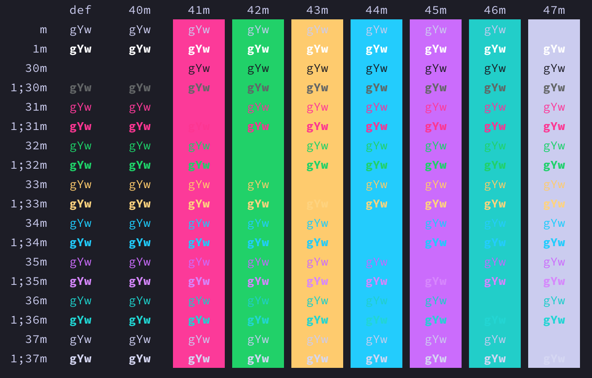
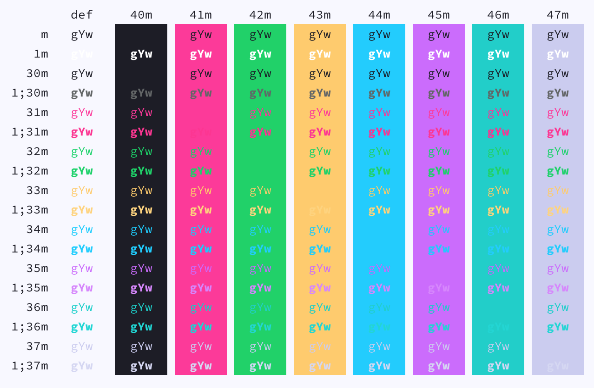

# Tinacious Design iTerm Colour Schemes

## Installation

Navigate to Preferences -> Profiles -> Colors and choose "Color presets..." -> Import

Find the downloaded schemes you'd like to use

## Schemes

The font I am using is [Source Code Pro](https://fonts.google.com/specimen/Source+Code+Pro) at size 13 pt.

### Tinacious Design (Dark)

### Tinacious Design (Light)

